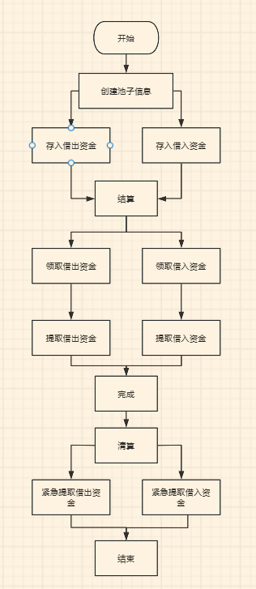
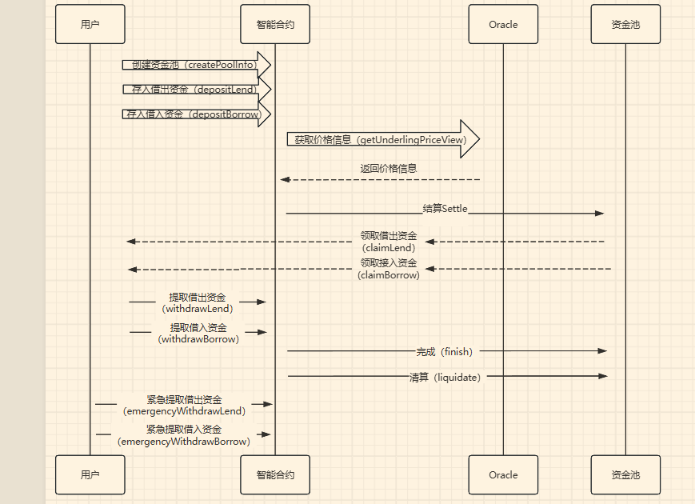

Pledge是一个去中心化（DeFi）金融项目，旨在提供固定利率的借贷协议，主要服务于加密资产持有者。以下是对Pledge项目的详细分析：

# 项目背景
Pledge旨在解决DeFi借贷市场中缺乏固定利率和固定期限融资产品的问题。传统的DeFi借贷协议通常采用可变利率，主要服务于短期交易者，而Pledge则专注于长期融资需求。

# 核心功能

- 固定利率借贷：Pledge提供固定利率的借贷服务，减少利率波动带来的风险。
- 去中心化Dex交易（核心）。

# 主要角色

- **借款人**：可以抵押加密资产以获得稳定币，用于投资非加密资产。
- **贷款人**：提供流动性，获得固定回报。
- **流动性提供者**：将稳定币锁定在流动性池中，提供流动性支持。
**业务流程图**

# 关键组件
- **智能合约**：自动执行借贷协议，确保交易记录上链且不可篡改。
- **pToken**：代表未来时间点的价值转移，用于借贷和清算。
- **PLGR代币**：Pledge平台的治理代币，用于协议治理和激励。

# 代码分析
PledgePool.sol是Pledge项目的核心智能合约之一，主要功能包括：
- **创建和管理借贷池**：包括设置借贷池的基本信息、状态管理等。
- **用户存款和取款**：处理用户的借款和贷款操作，包括存款、取款、索赔等。
- **自动清算**：根据设定的阈值自动触发清算操作，保护借贷双方的利益。
- **费用管理**：设置和管理借贷费用，确保平台的可持续运营。

# 事件和函数
- **事件**：如DepositLend、RefundLend、ClaimLend等，用于记录用户操作。
- **函数**：如depositLend、refundLend、claimLend等，实现具体的业务逻辑。

# 结论
Pledge项目通过提供固定利率的借贷服务，填补了DeFi市场的空白，旨在为加密资产持有者提供更稳定和长期的融资解决方案。其智能合约设计确保了操作的自动化和透明性，降低了传统金融系统中的信任成本。