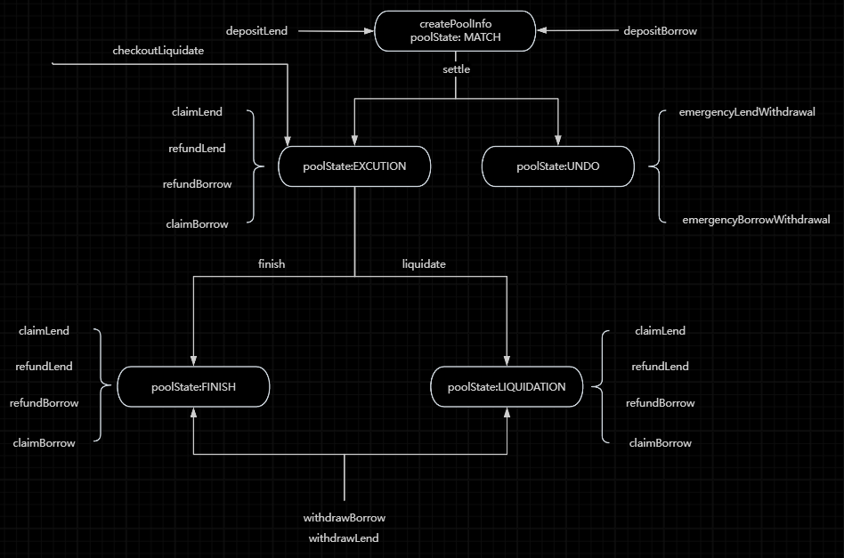

# Pledge系统文档

## 系统概况
借贷是DeFi领域非常重要的模块，Maker, Aave, Compound是当前借贷领域的三巨头。
Maker: 抵押资产获取稳定币DAI
Aave: 加密货币借贷协议
Compound: 加密货币借贷协议

Pledge是一个去中心化金融（DeFi）项目，旨在提供固定利率的借贷协议，主要服务于加密资产持有者。Pledge旨在解决DeFi借贷市场中缺乏固定利率和固定期限融资产品的问题。传统的DeFi借贷协议通常采用可变利率，主要服务于短期交易者，而Pledge则专注于长期融资需求。以下是对Pledge项目的详细分析：
## 功能需求
### 2.1 核心功能
- 固定利率借贷：Pledge提供固定利率的借贷服务，减少利率波动带来的风险。
- 去中心化Dex交易（核心）
### 2.2 主要角色
- 借款人：可以抵押加密资产以获得稳定币，用于投资非加密资产。
- 贷款人：提供流动性，获得固定回报。
### 2.3 关键组件
- 智能合约：自动执行借贷利率，确保交易记录上链且不可篡改。
- pToken/jToken: 代表未来时间点的价值转移，用于借贷和清算。
## 代码分析
PledgePool.sol是Pledge项目的核心智能合约之一，主要功能包括：

### 3.1 Pool
- 创建和管理借贷池：包括设置借贷池的基本信息、状态管理等。
- 用户存款和取款：处理用户的借款和贷款操作，包括存款、取款、索赔等。
- 自动清算：根据设定的阈值自动触发清算操作，保护借贷双方的利益。
- 费用管理：设置和管理借贷费用，确保平台的可持续运营。
 
 

## 事件和函数
- 事件：如DepositLend、RefundLend、ClaimLend等，用于记录用户操作。
- 函数：如depositLend、refundLend、claimLend等，实现具体的业务逻辑。
