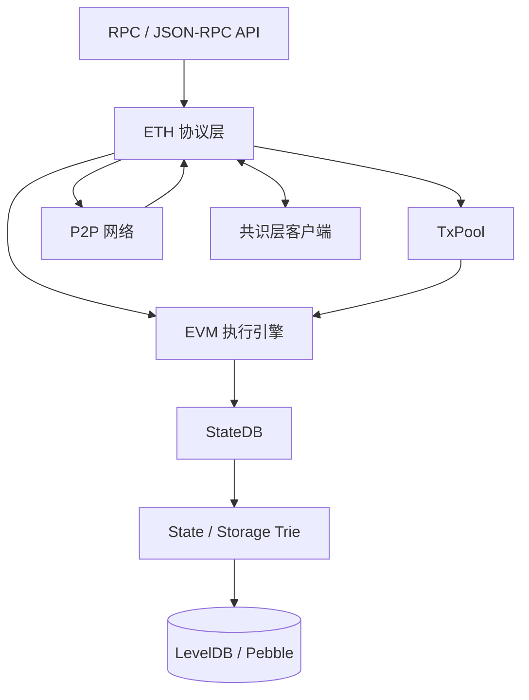
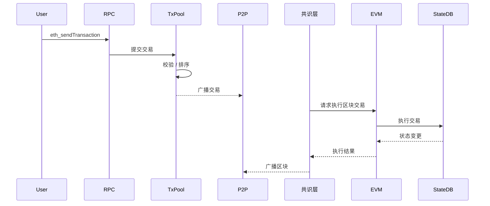
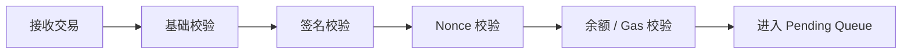
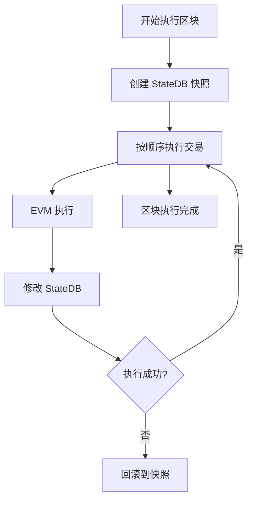
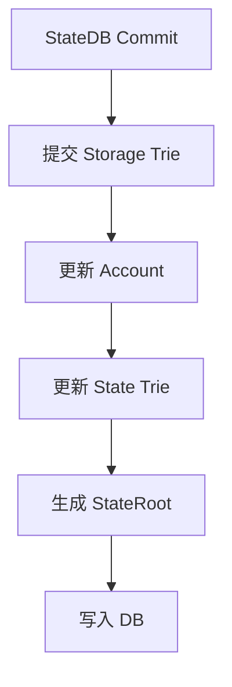

# Geth 功能架构图 & 交易生命周期流程图

本文以 **geth（Ethereum 执行层客户端）** 为核心，给出：

1. Geth 功能架构图（模块视角）  
2. 一笔交易在 geth 中的完整生命周期流程图  

文档采用 **Markdown + Mermaid**，可直接在支持 Mermaid 的编辑器中渲染（如 Typora、Obsidian、VS Code）。

---

## 一、Geth 功能架构图

### 1. 整体分层架构



---

### 2. 各模块职责说明

| 模块 | 职责 |
|---|---|
| RPC | 对外提供 JSON-RPC 接口 |
| ETH | 交易处理、区块执行、与共识层协作 |
| TxPool | 交易校验、排序、缓存 |
| EVM | 执行交易字节码 |
| StateDB | 状态缓存、事务、回滚 |
| Trie | 世界状态与合约存储 |
| DB | Trie Node 物理存储 |
| P2P | 交易、区块、头同步 |
| 共识层 | 出块、共识、最终性 |

---

## 二、交易生命周期流程图（宏观）

### 1. 从用户到区块



---

## 三、交易生命周期（geth 内部细化）

### 1. TxPool 阶段



- 校验失败：直接丢弃  
- 校验成功：进入 txpool 等待打包  

---

### 2. 区块执行阶段



---

### 3. State 提交流程



---

## 四、交易生命周期（时间线总结）

```
交易创建
 ↓
RPC 接收
 ↓
TxPool 校验 & 排序
 ↓
P2P 广播
 ↓
共识层选择 proposer
 ↓
执行层执行交易
 ↓
StateDB.Commit
 ↓
生成 StateRoot
 ↓
区块广播
 ↓
区块 Finalized
```

---

## 五、关键源码位置索引

| 功能 | 源码路径 |
|---|---|
| RPC | internal/ethapi |
| TxPool | core/txpool |
| 交易执行 | core/state_processor.go |
| EVM | core/vm |
| StateDB | core/state |
| Trie | trie |
| P2P | eth/protocols |
| Engine API | eth/catalyst |

---

## 六、总结

- Geth 是 **模块化执行层客户端**
- 交易生命周期以 TxPool → EVM → StateDB → Trie 为主线
- P2P 负责数据传播，共识层负责出块与最终性
- StateRoot 是执行层与共识层的核心连接点

---

> 推荐配合：`geth --dev --http` 实际跑一笔交易，对照流程图阅读源码。
