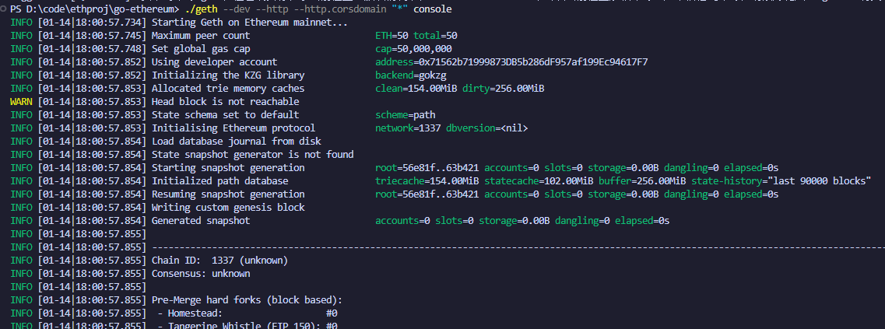
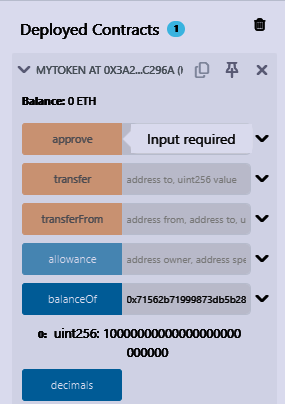
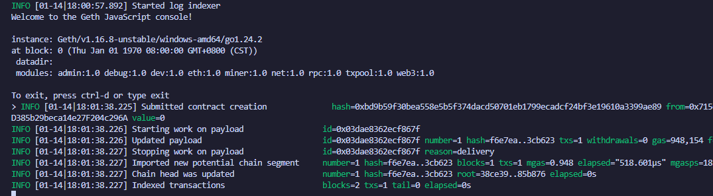

# 配置go环境
- windows
- golang
- git
# 下载go-ethereum仓库
git clone https://github.com/ethereum/go-ethereum.git
cd go-ethereum
# 编译
go build -o geth.exe ./cmd/geth
# 运行私有链
./geth --dev --http --http.corsdomain "*" console

# 部署合约图

